# @genart-dev/examples

14 curated generative art sketches across 5 rendering engines, each created from a single AI prompt. Published to npm for use in the [genart.dev](https://genart.dev/gallery) gallery.

## Install

```bash
npm install @genart-dev/examples
```

```ts
import { EXAMPLES, SKETCHES_DIR } from "@genart-dev/examples";
```

---

## Gallery

### p5.js

<table>
<tr>
<td width="300">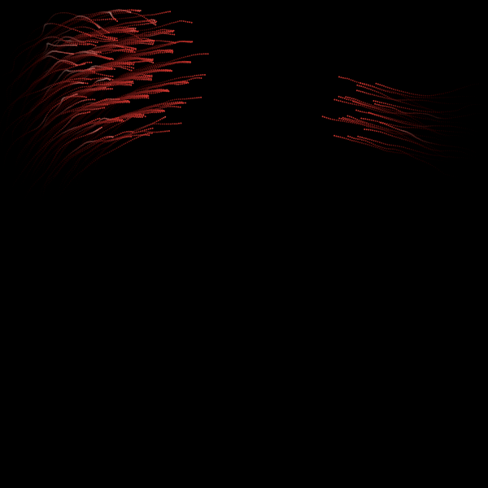</td>
<td>

**Murmuration**

> Create a boids flocking simulation with fading trails — hundreds of particles following separation, alignment, and cohesion rules, swirling like a flock of starlings at dusk.

Boids flocking with separation, alignment, and cohesion. Each bird leaves a fading trail, creating emergent order from three simple rules.

</td>
</tr>
<tr>
<td width="300">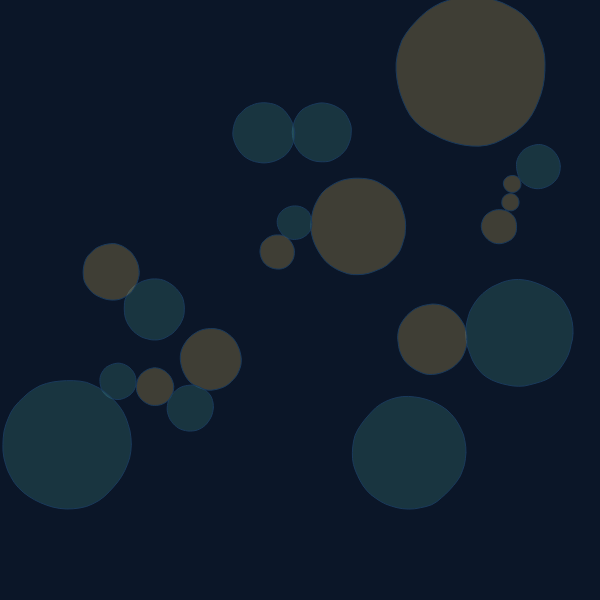</td>
<td>

**Tide Pool**

> Simulate organisms in a tidal rock pool — circles growing outward from random points, modulated by Perlin noise, stopping when they collide. Translucent, layered, aquatic palette.

Perlin-noise-modulated circle growth with collision detection. Organisms compete for space, creating a dense, translucent tidal composition.

</td>
</tr>
<tr>
<td width="300">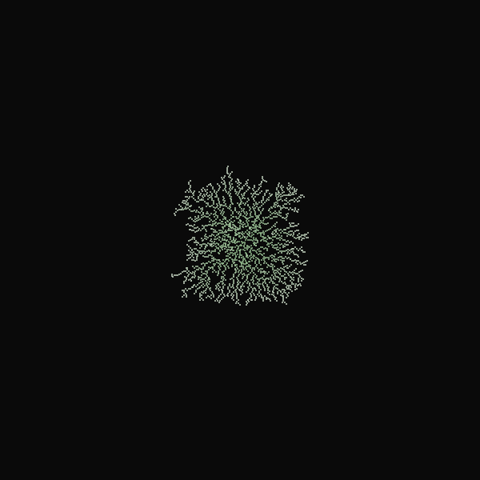</td>
<td>

**Lichen**

> Create a diffusion-limited aggregation (DLA) simulation — random walkers that stick to an existing structure, building fractal crystal-like growth from a single seed point.

Diffusion-limited aggregation: random walkers drift until they touch the growing structure and freeze in place. Fractal, patient, irreversible.

</td>
</tr>
</table>

### Canvas 2D

<table>
<tr>
<td width="300">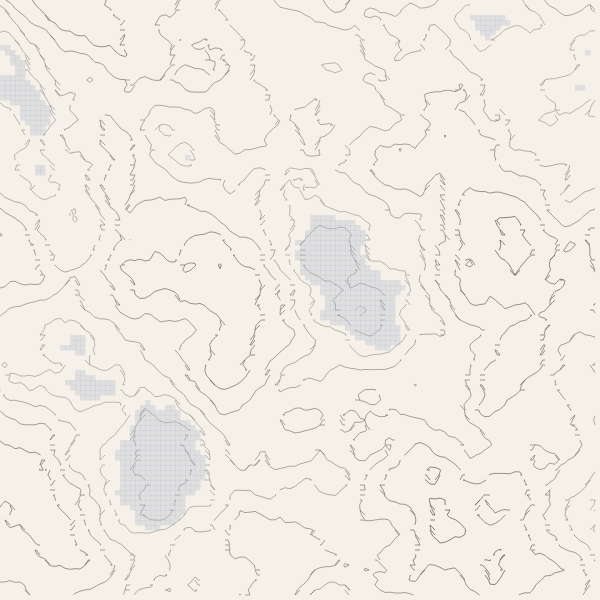</td>
<td>

**Erosion**

> Generate a geological survey map — a multi-octave noise heightmap with simulated water erosion and contour lines. Earthy, cartographic palette, scientific aesthetic.

Multi-octave Perlin noise heightmap with simulated water droplet erosion and contour line extraction. A fictional landscape survey.

</td>
</tr>
<tr>
<td width="300">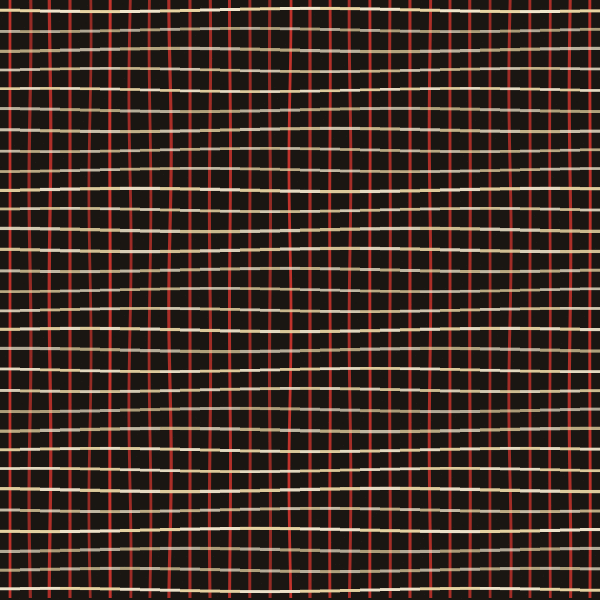</td>
<td>

**Textile**

> Simulate a handwoven textile — interlocking warp and weft threads with subtle variation in spacing and thickness. Each thread has character; the whole has structure.

Simulated warp/weft weave with pattern variation. Thread spacing, width, and color shift create the illusion of handwoven fabric.

</td>
</tr>
<tr>
<td width="300">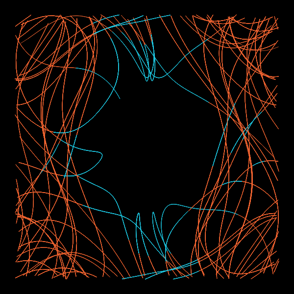</td>
<td>

**Phase Space**

> Explore the phase space of a double pendulum — plot the trajectory in angle-angle space using RK4 numerical integration. Reveal the chaotic attractor that emerges over time.

Double pendulum trajectory plotted in angle-angle phase space using RK4 integration. A deterministic system that never repeats.

</td>
</tr>
</table>

### Three.js

<table>
<tr>
<td width="300">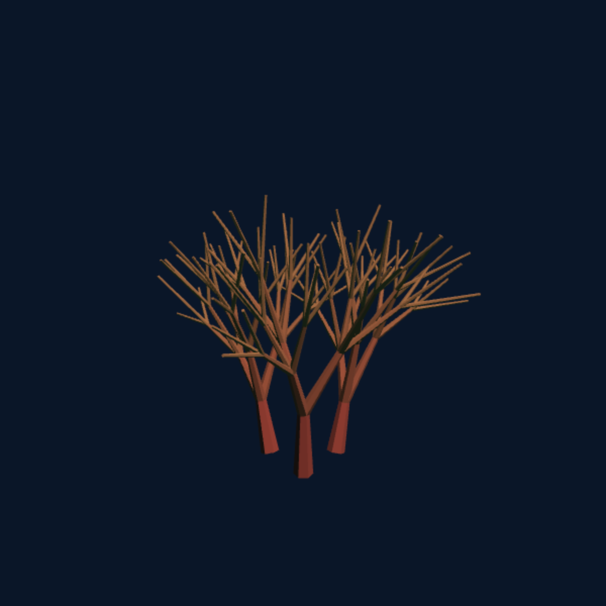</td>
<td>

**Coral**

> Create a 3D coral reef — L-system branching with randomized angles and underwater lighting. Each branch is a decision; the whole is a living architecture.

L-system branching in 3D with randomized angles. Directional lighting and warm-to-cool color gradients create depth.

</td>
</tr>
<tr>
<td width="300">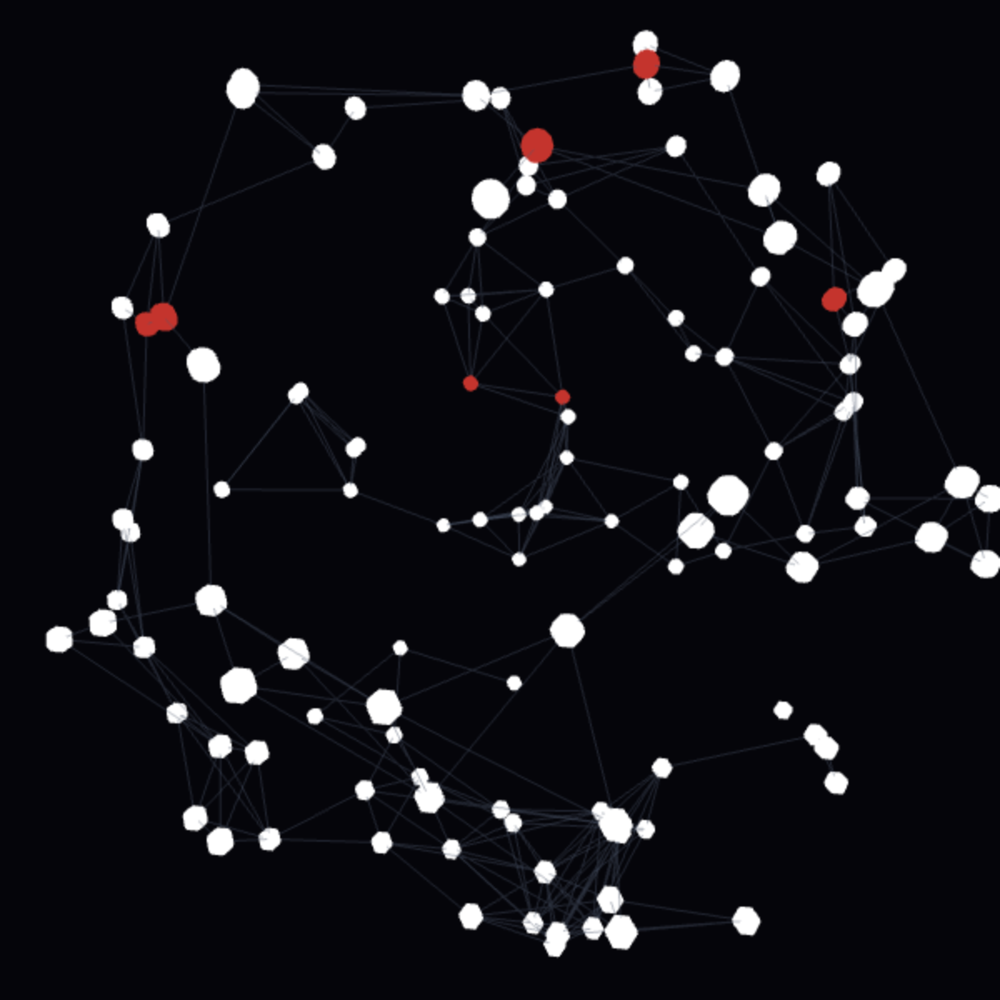</td>
<td>

**Constellation**

> Create a slowly orbiting star field — points distributed on a sphere with proximity-based edge connections. The human instinct to connect scattered points into meaning.

Points on a sphere with proximity-based edge connections. Stars orbit slowly, constellation lines form and dissolve.

</td>
</tr>
<tr>
<td width="300"></td>
<td>

**Origami**

> Animate an origami fold sequence — a flat mesh that sequentially folds along creases, transforming from a sheet into a geometric form. Geometry as transformation.

Sequential fold transformations on a flat mesh. Each fold rotates vertices around a crease axis, building complexity from flatness.

</td>
</tr>
</table>

### GLSL

<table>
<tr>
<td width="300">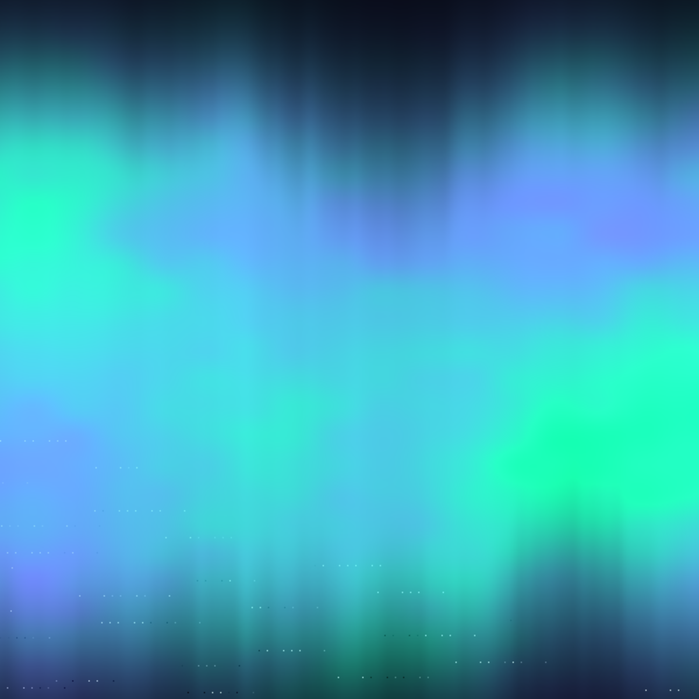</td>
<td>

**Aurora**

> Create a GLSL aurora borealis — multi-octave noise distorted along horizontal bands with additive color blending. Northern lights over a frozen landscape.

Multi-octave noise curtains with additive blending. Horizontal bands of light undulate and shift, mimicking auroral dynamics.

</td>
</tr>
<tr>
<td width="300">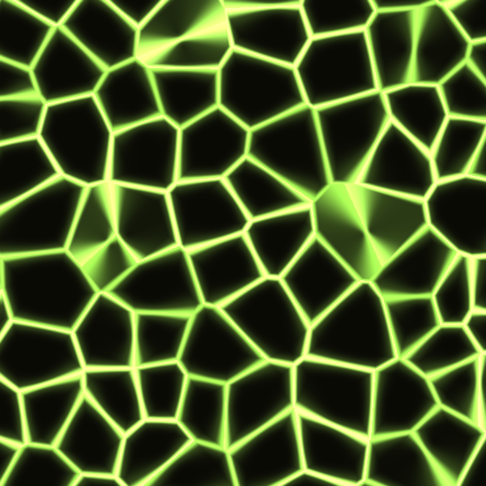</td>
<td>

**Mycelium**

> Create a GLSL mycelium network — Voronoi distance fields with animated veins along cell boundaries and a pulsing bioluminescent glow. The wood-wide web.

Voronoi distance field with animated veins along cell boundaries. Pulsing glow simulates nutrient flow through a fungal network.

</td>
</tr>
<tr>
<td width="300">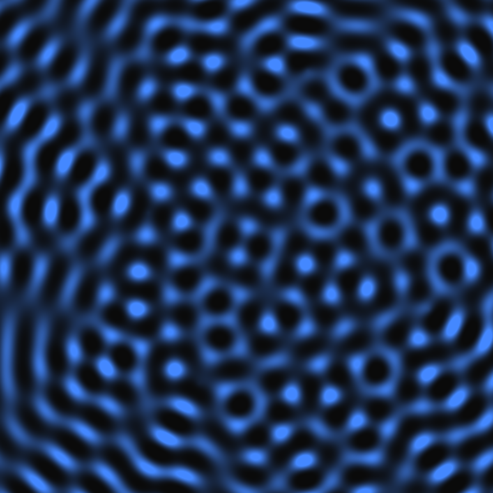</td>
<td>

**Interference**

> Create a GLSL wave interference pattern — multiple point sources emitting sine waves that overlap to create moire patterns. Ripples meeting ripples.

Multiple sine wave point sources with additive superposition. Constructive and destructive interference creates evolving moire patterns.

</td>
</tr>
</table>

### SVG

<table>
<tr>
<td width="300">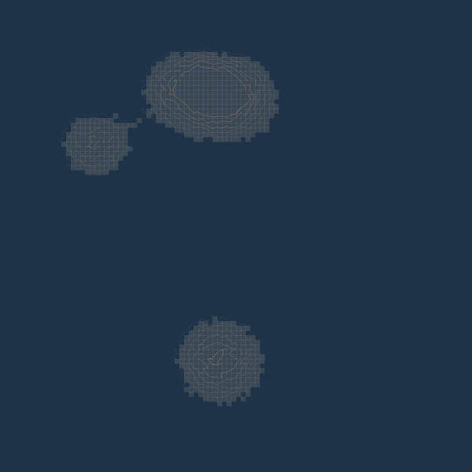</td>
<td>

**Archipelago**

> Generate an SVG cartographic map of fictional islands — noise heightmap thresholded at sea level with concentric contour lines for elevation. Imagined geography.

Noise heightmap thresholded at sea level, with concentric contour lines for elevation. A cartographer's map of islands that don't exist.

</td>
</tr>
<tr>
<td width="300">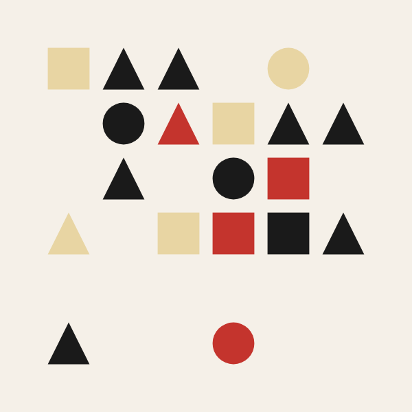</td>
<td>

**Letterpress**

> Apply Bauhaus composition principles — a grid of geometric primitives (circles, rectangles, triangles) placed by seeded RNG. Constraint breeds creativity.

Grid cells filled with geometric primitives by seeded RNG. Systematic composition where constraint breeds creativity.

</td>
</tr>
</table>

---

## Sketch format

Each `.genart` file is a self-contained JSON document with renderer type, parameters, color palette, seed, and algorithm source code. See [@genart-dev/format](https://github.com/genart-dev/format) for the spec.

## Renderers

| Engine | Sketches | WebGL |
|--------|----------|-------|
| p5.js | Murmuration, Tide Pool, Lichen | No |
| Canvas 2D | Erosion, Textile, Phase Space | No |
| Three.js | Coral, Constellation, Origami | Yes |
| GLSL | Aurora, Mycelium, Interference | Yes |
| SVG | Archipelago, Letterpress | No |

## Support

Questions, bugs, or feedback — [support@genart.dev](mailto:support@genart.dev) or [open an issue](https://github.com/genart-dev/examples/issues).

## License

MIT
