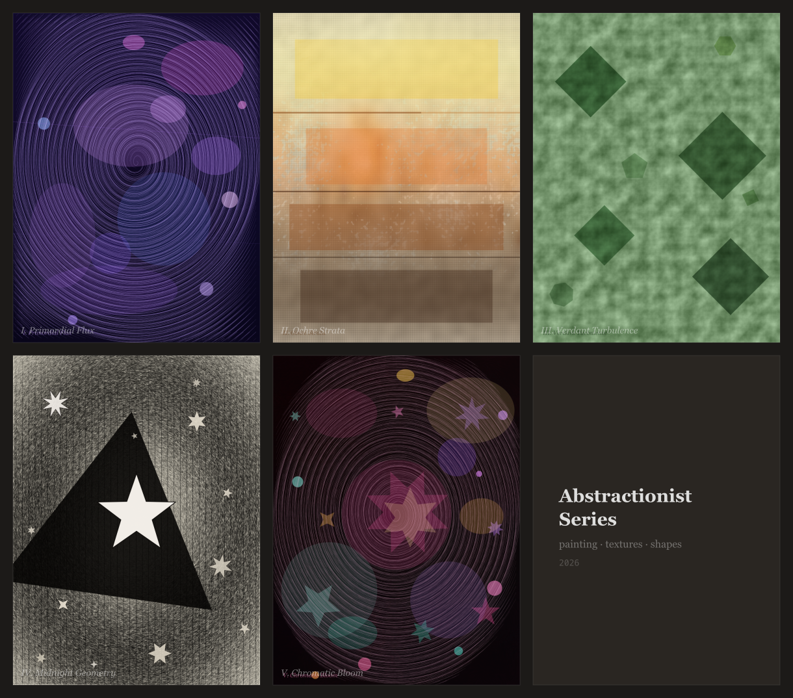
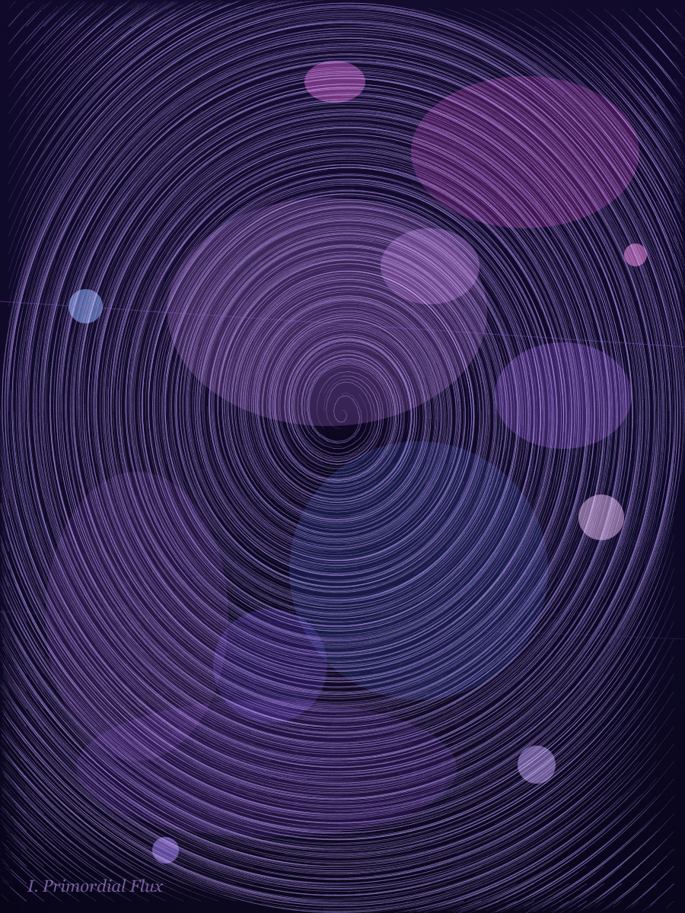
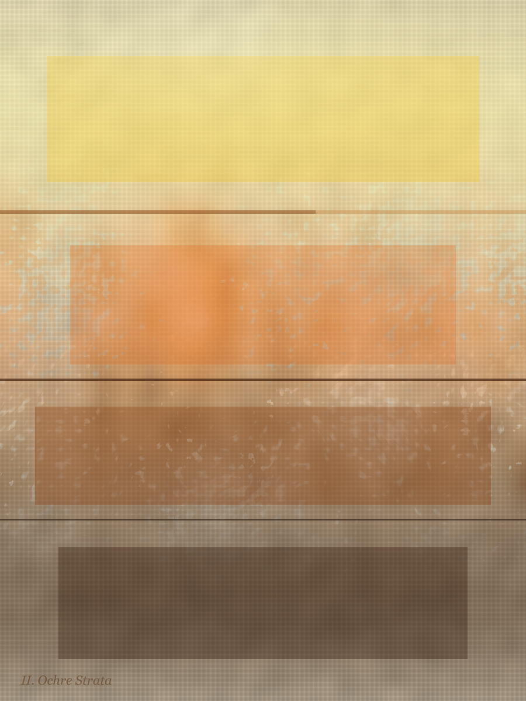
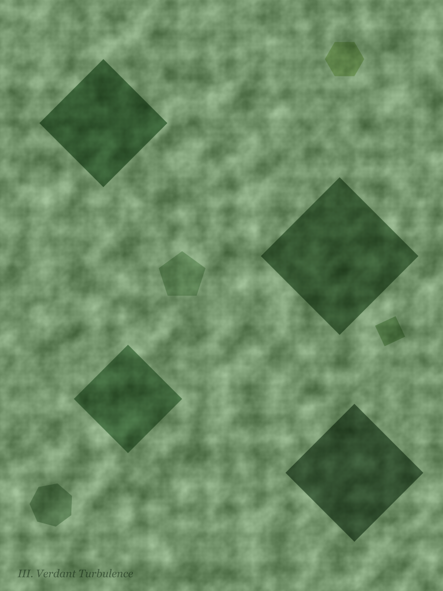
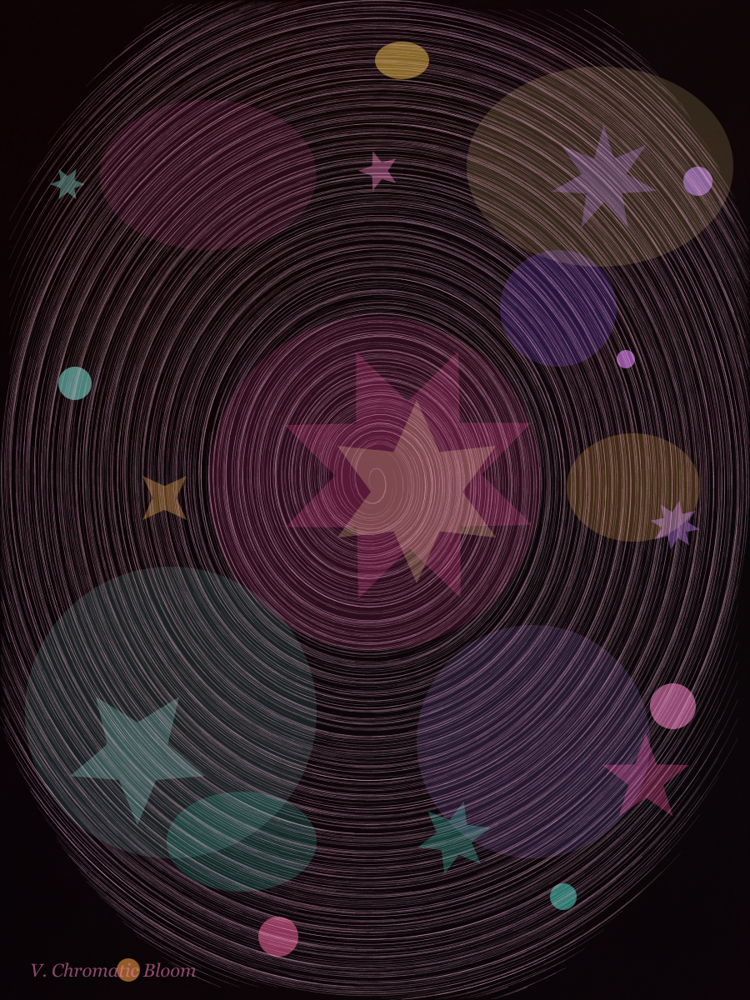

# Abstractionist Series

A series of five generative paintings created by compositing plugin layer types directly — without the `.genart` format or a renderer host. This is an **experimental approach** for building multi-layer compositions in Node.js using the plugin APIs.



## The paintings

### I. Primordial Flux
Vortex watercolor · washi texture · bokeh ellipses in indigo/violet



### II. Ochre Strata
Oil impasto · canvas texture · Rothko-style floating color fields



### III. Verdant Turbulence
Gouache base washes · ink streamlines · dark green squares



### IV. Midnight Geometry
Charcoal vortex · rough paper · dark triangle · star constellation


### V. Chromatic Bloom
Radial watercolor blooms · pastel diffusion · bokeh ellipses · star shapes



## How it works

Each painting is a plain JS function that:

1. Creates a `node-canvas` canvas
2. Calls plugin `LayerTypeDefinition.render()` methods directly, stacking them in order
3. Saves the result as PNG

No format, no host app, no MCP — just direct API calls.

```js
const { watercolorLayerType } = require("@genart-dev/plugin-painting");
const { paperLayerType } = require("@genart-dev/plugin-textures");
const { starLayerType } = require("@genart-dev/plugin-shapes");
const { createCanvas } = require("canvas");

const canvas = createCanvas(900, 1200);
const ctx = canvas.getContext("2d");
const bounds = { x: 0, y: 0, width: 900, height: 1200, rotation: 0, scaleX: 1, scaleY: 1 };
const resources = { getFont: () => null, getImage: () => null, theme: "light", pixelRatio: 1 };

// Stack layers bottom-up
paperLayerType.render(paperLayerType.createDefault(), ctx, bounds, resources);
watercolorLayerType.render({ ...watercolorLayerType.createDefault(), field: "vortex:0.5:0.5:0.4" }, ctx, bounds, resources);
```

## Running

From this directory, install deps and run:

```sh
npm install
node render.cjs
```

Renders are written to `renders/`.

## Dependencies

```json
{
  "dependencies": {
    "@genart-dev/plugin-painting": "*",
    "@genart-dev/plugin-textures": "*",
    "@genart-dev/plugin-shapes": "*",
    "canvas": "^3.1.0"
  }
}
```

> These packages resolve from the local monorepo workspace. In a standalone project, pin specific published versions.

## Why this approach?

The standard `.genart` format embeds algorithms as strings executed by a renderer host (GLSL, SVG, canvas2d inline JS). Plugin layer types are richer — they have their own property schemas, vector field systems, blend modes, and masking — but they can't yet be declared in a `.genart` file.

This project demonstrates the gap and serves as a reference for what a future `plugin-layers` renderer type in the format might look like: a declarative layer stack where each entry has a `typeId`, `properties`, and `bounds`.

See the planning notes in [plugin-layers-renderer.md](plugin-layers-renderer.md) for the open questions.
