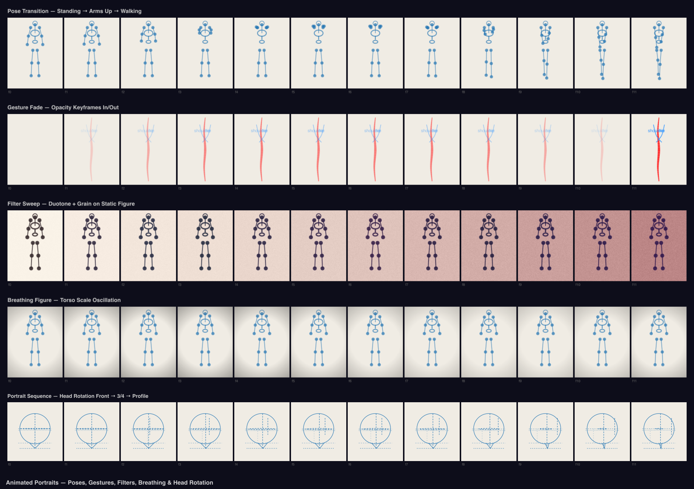

# Animated Portraits

Animated figure compositions using `@genart-dev/plugin-figure`, `@genart-dev/plugin-animation`, and `@genart-dev/plugin-filters`.



## Scenes

| # | Scene | Description |
|---|-------|-------------|
| 1 | Pose Transition | Mannequin interpolated between 3 keyframed poses |
| 2 | Gesture Fade | Gesture drawing with opacity keyframes |
| 3 | Filter Sweep | Static figure with animated duotone + grain transitions |
| 4 | Breathing Figure | Subtle scale oscillation on mannequin torso |
| 5 | Portrait Sequence | Head construction rotating from front to profile |
| 6 | Animation Sheet | Contact sheet of key frames |

## Plugins

- `@genart-dev/plugin-figure` — `mannequinLayerType`, `gestureLayerType`, `headLayerType`
- `@genart-dev/plugin-animation` — `timelineLayerType`, `interpolateProperty`, `applyKeyframeEasing`
- `@genart-dev/plugin-filters` — `duotoneLayerType`, `grainLayerType`, `vignetteLayerType`

## Usage

```bash
npm install
node render.cjs
```

Output goes to `renders/`.
