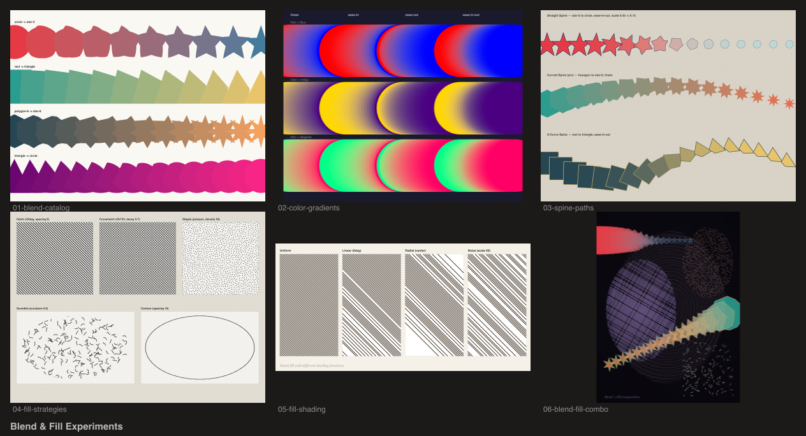

# Blend & Fill Experiments

Experiments with shape blending (`plugin-shapes`) and hatched/stippled fills (`plugin-painting`) — morphing, color gradients, spine paths, fill strategies, and shading.



## Demos

| # | Demo | Description |
|---|------|-------------|
| 1 | Blend Catalog | Shape morphing: circle to star, rect to triangle, polygon to star |
| 2 | Color Gradients | Oklab color blending with linear, ease-in, ease-out, and ease-in-out |
| 3 | Spine Paths | Blends along straight, arc, and S-curve spines |
| 4 | Fill Strategies | Hatch, crosshatch, stipple, scumble, and contour fills side by side |
| 5 | Fill Shading | Uniform, linear, radial, and noise shading on hatched fills |
| 6 | Blend + Fill Combo | Full composition combining blends, fills, watercolor wash, and ink accents |

## Plugins

- `@genart-dev/plugin-shapes` — `blendLayerType`, `rectLayerType`, `ellipseLayerType`, `polygonLayerType`, `starLayerType`
- `@genart-dev/plugin-painting` — `fillLayerType`, `strokeLayerType`, `inkLayerType`, `watercolorLayerType`, `BRUSH_PRESETS`, `preloadTextureTip`
- `@genart-dev/plugin-textures` — `paperLayerType`

## Usage

```bash
npm install
node render.cjs
```

Output goes to `renders/`.
