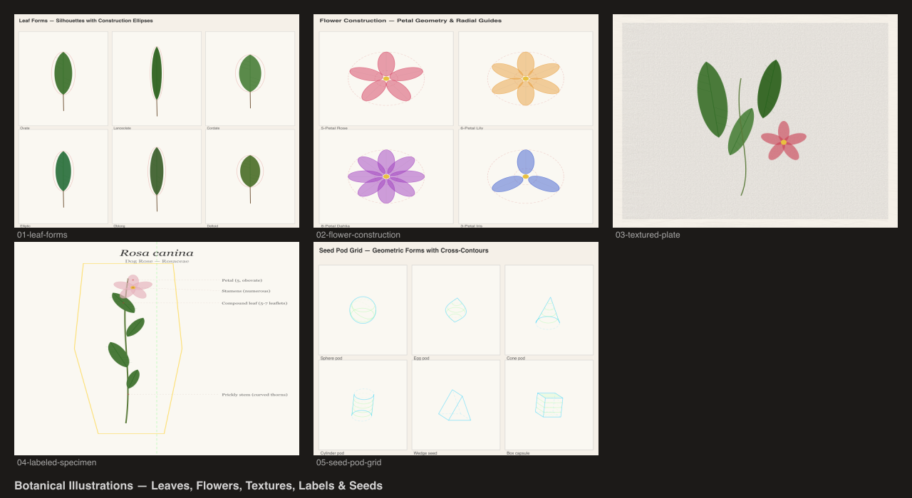

# Botanical Illustrations

Labeled botanical plates using multiple plugins together.



## Scenes

| # | Scene | Description |
|---|-------|-------------|
| 1 | Leaf Forms | Leaf shapes from ellipses + polygons with cross-contour veins |
| 2 | Flower Construction | Envelope-based petal arrangement geometry |
| 3 | Textured Plate | Paper texture background, washi border, botanical forms |
| 4 | Labeled Specimen | Plant form + construction lines + italic labels |
| 5 | Seed Pod Grid | 3x3 geometric seed pods with value shading |
| 6 | Botanical Plate | Full combined composition |

## Plugins

- `@genart-dev/plugin-shapes` — `ellipseLayerType`, `polygonLayerType`, `lineLayerType`
- `@genart-dev/plugin-textures` — `paperLayerType`, `washiLayerType`
- `@genart-dev/plugin-construction` — `formLayerType`, `crossContourLayerType`, `envelopeLayerType`
- `@genart-dev/plugin-typography` — `textLayerType`

## Usage

```bash
npm install
node render.cjs
```

Output goes to `renders/`.
