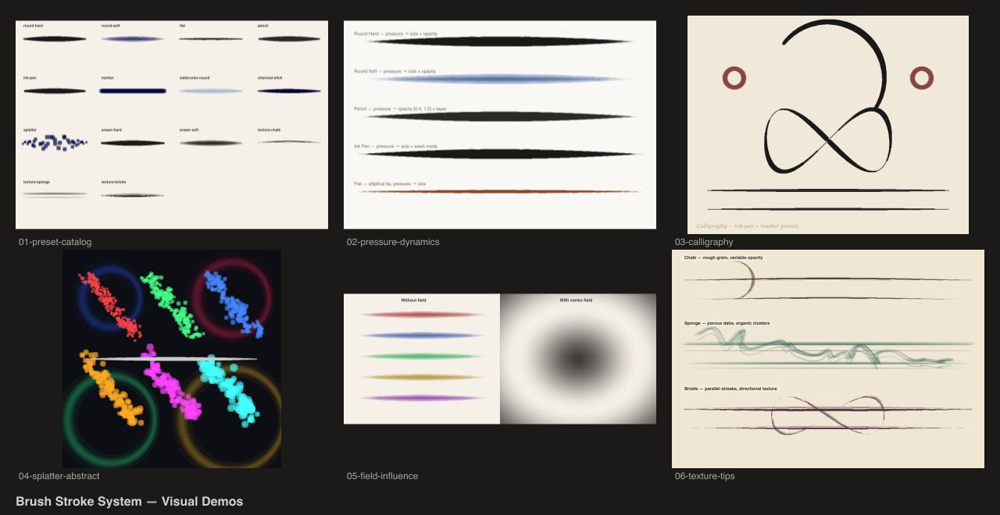

# Brush Stroke Demos

Visual demos of the brush stroke system — 14 presets, pressure dynamics, calligraphy, splatter, vector fields, and texture tips.



## Demos

| # | Demo | Description |
|---|------|-------------|
| 1 | Preset Catalog | All 14 brush presets (11 round + 3 texture) drawing S-curves side by side |
| 2 | Pressure Dynamics | Pressure-sensitive strokes showing taper and width variation |
| 3 | Calligraphy | Ink-pen curves, loops, and flourishes on parchment |
| 4 | Splatter Abstract | Splatter + watercolor-round scatter painting on dark background |
| 5 | Field Influence | Strokes with and without vortex vector field modulation |
| 6 | Texture Tips | Chalk, sponge, and bristle texture brush strokes on paper |

## Plugins

- `@genart-dev/plugin-painting` — `strokeLayerType`, `BRUSH_PRESETS`, `preloadTextureTip`
- `@genart-dev/plugin-textures` — (optional) `washiLayerType`

## Usage

```bash
npm install
node render.cjs
```

Output goes to `renders/`.
