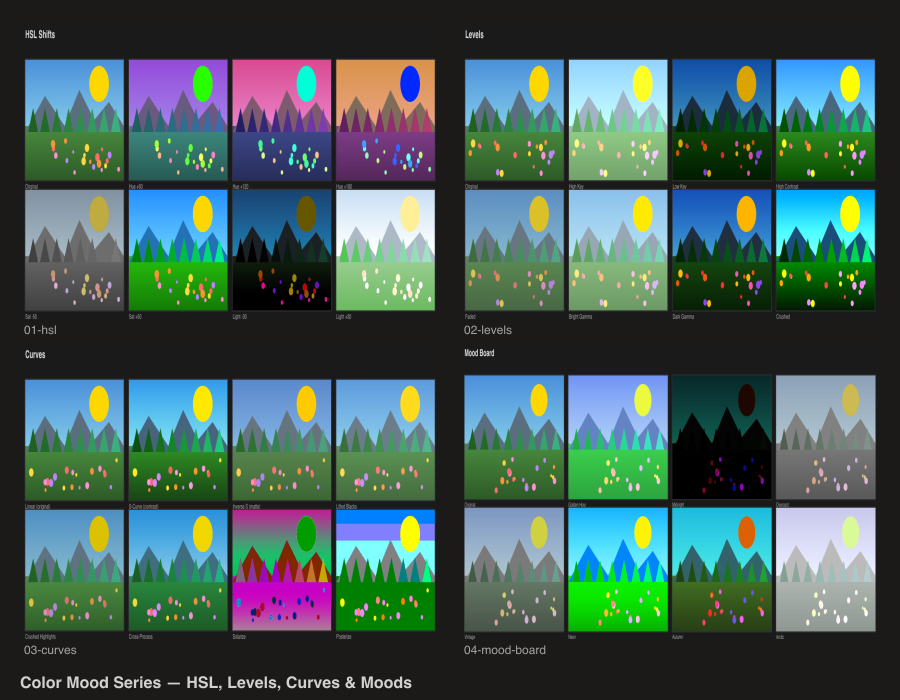

# Color Mood Series

Color adjustment variations showcasing `@genart-dev/plugin-color-adjust`.



## Scenes

| # | Scene | Description |
|---|-------|-------------|
| 1 | HSL Shifts | Hue rotation (60/120/180), saturation and lightness sweeps |
| 2 | Levels | High key, low key, high contrast, faded, gamma variations |
| 3 | Curves | S-curve, lifted blacks, crushed highlights, cross-process, solarize, posterize |
| 4 | Mood Board | 7 named moods — golden hour, midnight, overcast, vintage, neon, autumn, arctic |
| 5 | Contact Sheet | Combined overview of all scenes |

## Plugins

- `@genart-dev/plugin-color-adjust` — `hslLayerType`, `levelsLayerType`, `curvesLayerType`

## Usage

```bash
npm install
node render.cjs
```

Output goes to `renders/`.
