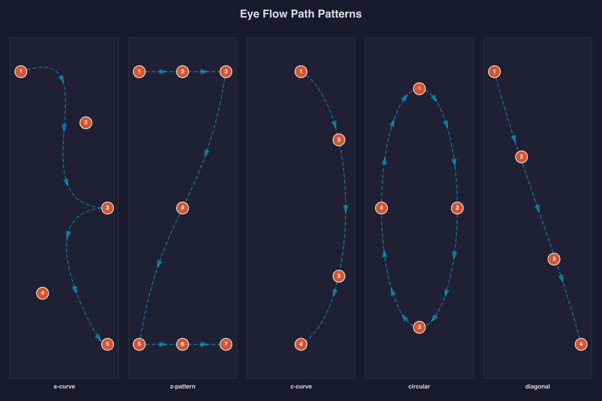
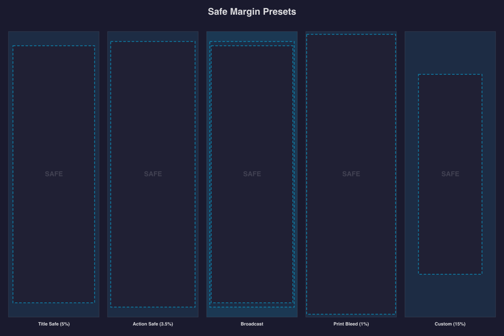
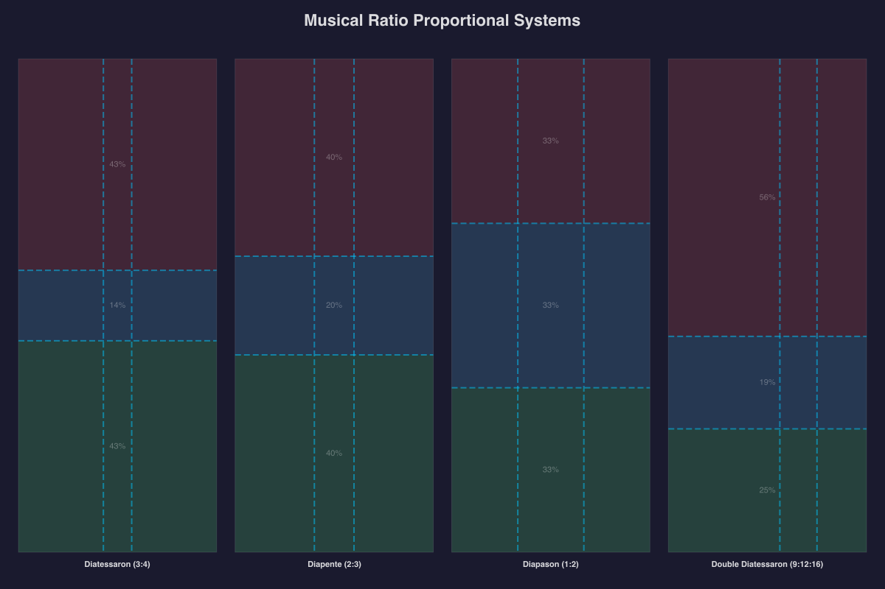
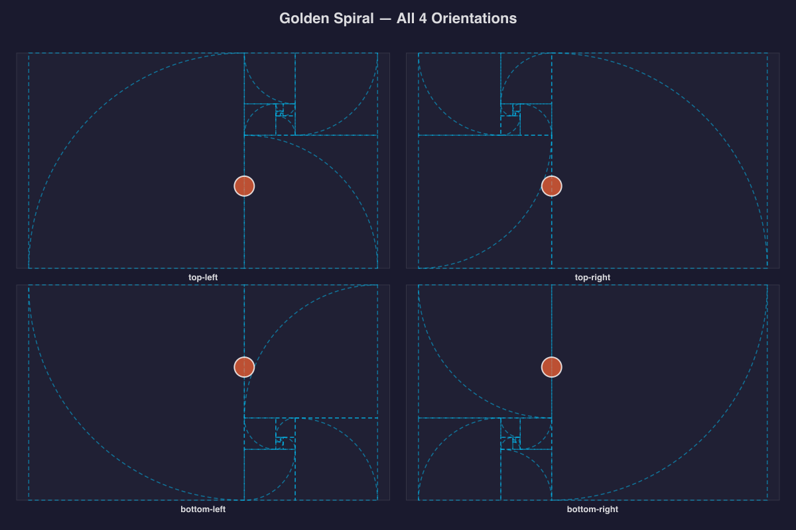

# Composition Explorer

Visual explorer of all 10 composition guide types from `@genart-dev/plugin-layout-composition`.

## Usage

```bash
yarn install
yarn render
```

Outputs 5 PNG files to `renders/`.

## Renders

### Classical Painting Composition Systems

A 3x2 grid comparing 6 classical composition systems — golden spiral, golden triangle, harmonic armature, rabatment, dynamic symmetry, and phi grid — each with still-life elements placed at the system's focal points, sized by importance.


### Eye Flow Path Patterns

All 5 flow path patterns (s-curve, z-pattern, c-curve, circular, diagonal) with numbered waypoint circles showing how the eye traverses each layout.



### Safe Margin Presets

5 safe margin presets side by side — title-safe (5%), action-safe (3.5%), broadcast (both), print-bleed (1%), and custom (15%) — with shaded margin areas showing the usable region.



### Musical Ratio Proportional Systems

The 4 named musical ratios (diatessaron, diapente, diapason, double-diatessaron) with colored bands between division lines visualizing each proportional system.



### Golden Spiral Orientations

Golden spiral in all 4 orientations with a focal circle placed at each spiral's convergence point.



## Guide Types Covered

| # | Guide | Render |
|---|-------|--------|
| 1 | Golden Spiral | classical-systems, spiral-orientations |
| 2 | Golden Triangle | classical-systems |
| 3 | Harmonic Armature | classical-systems |
| 4 | Rabatment | classical-systems |
| 5 | Dynamic Symmetry | classical-systems |
| 6 | Phi Grid | classical-systems |
| 7 | Flow Path | flow-analysis |
| 8 | Safe Margins | safe-zones |
| 9 | Musical Ratios | musical-harmony |
| 10 | Diagonal Grid | _(used internally by armature)_ |
