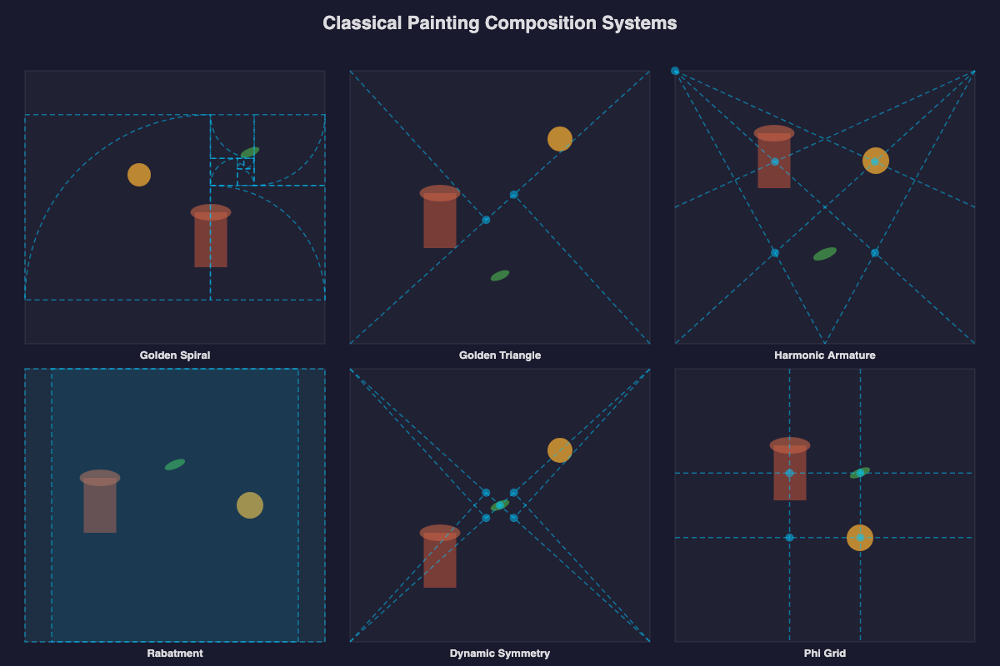

# Composition Explorer

Visual explorer of all 10 composition guide types from `@genart-dev/plugin-layout-composition`.



## Scenes

| # | Scene | Source | Description |
|---|-------|--------|-------------|
| 1 | Classical Systems | [classical-systems.genart](renders/classical-systems.genart) | 6 painting composition systems with still-life elements at focal points |
| 2 | Flow Analysis | [flow-analysis.genart](renders/flow-analysis.genart) | 5 flow path patterns with numbered waypoints |
| 3 | Safe Zones | [safe-zones.genart](renders/safe-zones.genart) | 5 safe margin presets with shaded margin areas |
| 4 | Musical Harmony | [musical-harmony.genart](renders/musical-harmony.genart) | 4 musical ratio systems with colored proportion bands |
| 5 | Spiral Orientations | [spiral-orientations.genart](renders/spiral-orientations.genart) | Golden spiral in all 4 orientations with focal circles |

## Guide Types Covered

| # | Guide | Render |
|---|-------|--------|
| 1 | Golden Spiral | classical-systems, spiral-orientations |
| 2 | Golden Triangle | classical-systems |
| 3 | Harmonic Armature | classical-systems |
| 4 | Rabatment | classical-systems |
| 5 | Dynamic Symmetry | classical-systems |
| 6 | Phi Grid | classical-systems |
| 7 | Flow Path | flow-analysis |
| 8 | Safe Margins | safe-zones |
| 9 | Musical Ratios | musical-harmony |
| 10 | Diagonal Grid | _(used internally by armature)_ |

## Plugins

- `@genart-dev/plugin-layout-composition` — `guides:golden-spiral`, `guides:golden-triangle`, `guides:armature`, `guides:rabatment`, `guides:dynamic-symmetry`, `guides:phi-grid`, `guides:flow-path`, `guides:safe-margins`, `guides:musical-ratios`

## Usage

```bash
bash renders/render.sh
```

Output PNGs go to `renders/`.
