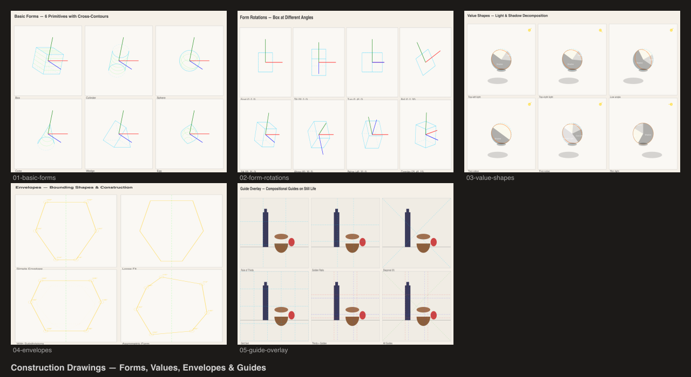

# Construction Drawings

Geometric constructions and compositional guides showcasing `@genart-dev/plugin-construction` and `@genart-dev/plugin-layout-guides`.



## Scenes

| # | Scene | Description |
|---|-------|-------------|
| 1 | Basic Forms | 6 form primitives (box, cylinder, sphere, cone, wedge, egg) with cross-contours and axes |
| 2 | Form Rotations | Box rotated through 8 different X/Y/Z angle combinations |
| 3 | Value Shapes | Light/shadow decomposition — 2, 3, and 5-value groupings with varying light directions |
| 4 | Envelopes | Bounding shapes — tight, loose, with angles, plumb lines, and subdivisions |
| 5 | Guide Overlay | Thirds, golden ratio, diagonals, and grid guides over a still life composition |
| 6 | Technical Plate | Combined overview of all scenes |

## Plugins

- `@genart-dev/plugin-construction` — `formLayerType`, `valueShapesLayerType`, `envelopeLayerType`
- `@genart-dev/plugin-layout-guides` — `gridGuideLayerType`, `thirdsGuideLayerType`, `goldenRatioGuideLayerType`, `diagonalGuideLayerType`

## Usage

```bash
npm install
node render.cjs
```

Output goes to `renders/`.
