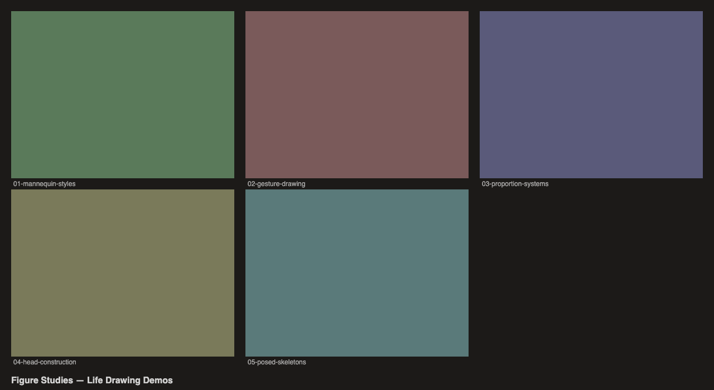

# Figure Studies

Life drawing studies showcasing `@genart-dev/plugin-figure` and `@genart-dev/plugin-poses`.



## Scenes

| # | Scene | Source | Description |
|---|-------|--------|-------------|
| 1 | Mannequin Styles | [01-mannequin-styles.genart](renders/01-mannequin-styles.genart) | Same pose rendered in 5 styles — stick, bean, blocks, loomis, anatomy |
| 2 | Gesture Drawing | [02-gesture-drawing.genart](renders/02-gesture-drawing.genart) | Line of action and rhythm curves with varying energy and taper |
| 3 | Proportion Systems | [03-proportion-systems.genart](renders/03-proportion-systems.genart) | 7 proportion standards — realistic, heroic, fashion, manga, chibi, child, toddler |
| 4 | Head Construction | [04-head-construction.genart](renders/04-head-construction.genart) | Loomis, Asaro, and simple heads from 9 angles |
| 5 | Posed Skeletons | [05-posed-skeletons.genart](renders/05-posed-skeletons.genart) | Skeleton styles and color modes with standing, sitting, and dynamic poses |
| 6 | Figure Sheet | [figure-sheet.genart](renders/figure-sheet.genart) | Contact sheet of all scenes |

## Plugins

- `@genart-dev/plugin-figure` — `figure:mannequin`, `figure:gesture`, `figure:head`, `figure:proportion-grid`
- `@genart-dev/plugin-poses` — `poses:skeleton`

## Usage

```bash
bash renders/render.sh
```

Output PNGs go to `renders/`.
