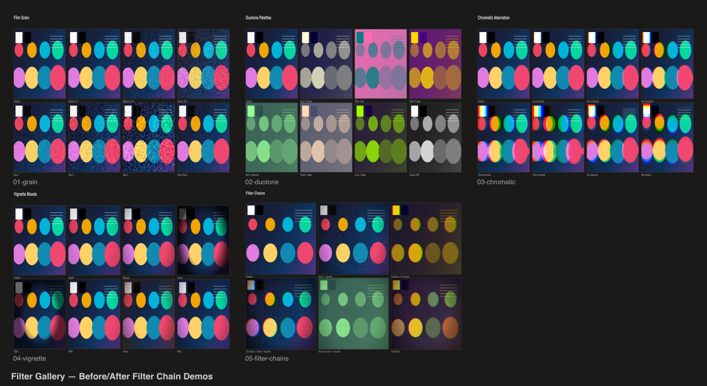

# Filter Gallery

Before/after filter chain demos showcasing `@genart-dev/plugin-filters`.



## Scenes

| # | Scene | Description |
|---|-------|-------------|
| 1 | Grain Textures | Film grain — intensity sweep, size sweep, monochrome vs color |
| 2 | Duotone Palettes | 7 duotone color pairs on the same test pattern |
| 3 | Chromatic Aberration | RGB channel offset from 1px to 15px, horizontal/vertical/diagonal |
| 4 | Vignette Moods | Varying softness, radius, and color (black, sepia, blue) |
| 5 | Filter Chains | Stacked filters — grain+vignette, duotone+chromatic, full stack |
| 6 | Contact Sheet | Combined overview of all scenes |

## Plugins

- `@genart-dev/plugin-filters` — `grainLayerType`, `duotoneLayerType`, `chromaticAberrationLayerType`, `vignetteLayerType`

## Usage

```bash
npm install
node render.cjs
```

Output goes to `renders/`.
