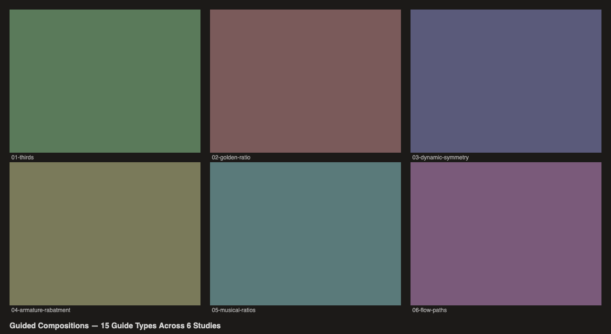

# Guided Compositions

Compositional guide system showcase using `@genart-dev/plugin-layout-guides` and `@genart-dev/plugin-layout-composition`.



## Scenes

| # | Scene | Source | Description |
|---|-------|--------|-------------|
| 1 | Rule of Thirds | [01-thirds.genart](renders/01-thirds.genart) | Thirds, diagonals, and phi grid overlays on landscape |
| 2 | Golden Ratio | [02-golden-ratio.genart](renders/02-golden-ratio.genart) | Golden spiral in 4 orientations with phi lines |
| 3 | Dynamic Symmetry | [03-dynamic-symmetry.genart](renders/03-dynamic-symmetry.genart) | Diagonals, reciprocals, diagonal grid, golden triangle |
| 4 | Armature & Rabatment | [04-armature-rabatment.genart](renders/04-armature-rabatment.genart) | Armature, rabatment, combined, and safe margins |
| 5 | Musical Ratios | [05-musical-ratios.genart](renders/05-musical-ratios.genart) | Harmonic divisions with phi grid and spiral combos |
| 6 | Flow Paths | [06-flow-paths.genart](renders/06-flow-paths.genart) | Eye movement trajectories — s-curve, z-path, spiral, triangle |
| 7 | Guide Comparison | [guide-comparison.genart](renders/guide-comparison.genart) | Contact sheet of all scenes |

## Plugins

- `@genart-dev/plugin-layout-guides` — `guides:thirds`, `guides:golden-ratio`, `guides:diagonal`
- `@genart-dev/plugin-layout-composition` — `guides:golden-spiral`, `guides:golden-triangle`, `guides:armature`, `guides:rabatment`, `guides:dynamic-symmetry`, `guides:musical-ratios`, `guides:flow-path`, `guides:phi-grid`, `guides:diagonal-grid`, `guides:safe-margins`

## Usage

```bash
bash renders/render.sh
```

Output PNGs go to `renders/`.
