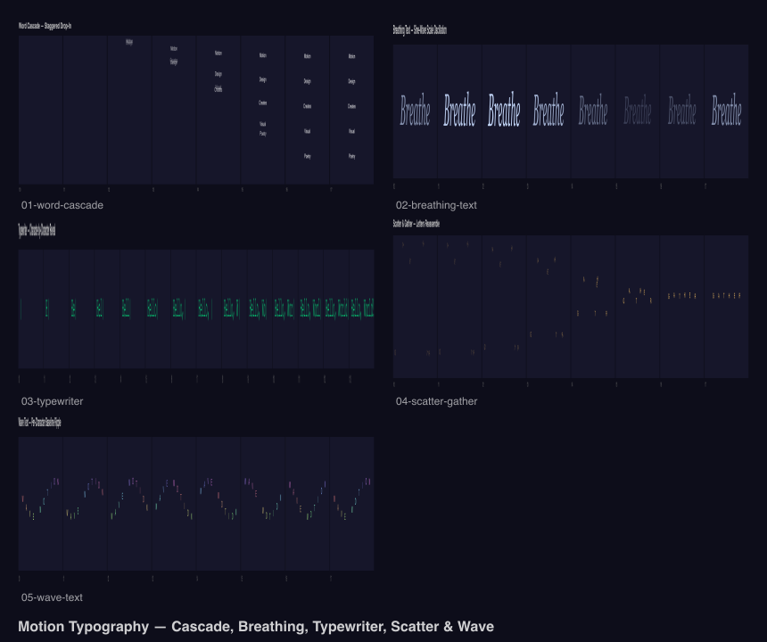

# Motion Typography

Kinetic type compositions using `@genart-dev/plugin-typography` and `@genart-dev/plugin-animation`.



## Scenes

| # | Scene | Description |
|---|-------|-------------|
| 1 | Word Cascade | Words falling into position with staggered easing |
| 2 | Breathing Text | Text scaling with sine-wave oscillation |
| 3 | Typewriter | Character-by-character reveal with cursor blink |
| 4 | Scatter & Gather | Letters explode outward then reassemble |
| 5 | Wave Text | Baseline wave rippling through a sentence |
| 6 | Motion Type Sheet | Contact sheet of key frames |

## Plugins

- `@genart-dev/plugin-typography` — `textLayerType`, `BUILT_IN_FONTS`
- `@genart-dev/plugin-animation` — `timelineLayerType`, `interpolateProperty`, `applyKeyframeEasing`

## Usage

```bash
npm install
node render.cjs
```

Output goes to `renders/`.
