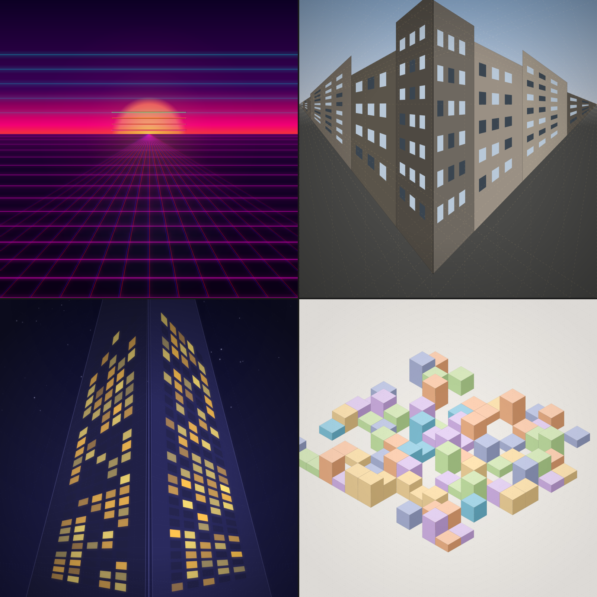

# Perspective Scenes

Visual showcase of `@genart-dev/plugin-perspective` — one-point, two-point, three-point, and isometric perspective scenes.



## Recipes

| # | Recipe | Description |
|---|--------|-------------|
| 1 | Synthwave Sunset | One-point perspective floor grid with neon glow, CRT scanlines, and chromatic aberration |
| 2 | City Corner | Two-point grid with building facades, lit windows, and a street-level view |
| 3 | Vertigo Tower | Three-point worm's-eye tower with glowing windows against a starry sky |
| 4 | Isometric Workshop | Isometric grid with pastel cubes scattered in a painterly arrangement |

## Plugins

- `@genart-dev/plugin-perspective` — `twoPointGridLayerType`, `threePointGridLayerType`, `isometricGridLayerType`, `clipLineToRect`, `lineIntersection`

## Usage

```bash
npm install
node render-recipes.cjs        # render all 4 scenes
node montage.cjs               # composite into 2x2 montage
npm run render:all              # both steps
```

Output goes to `renders/`.
