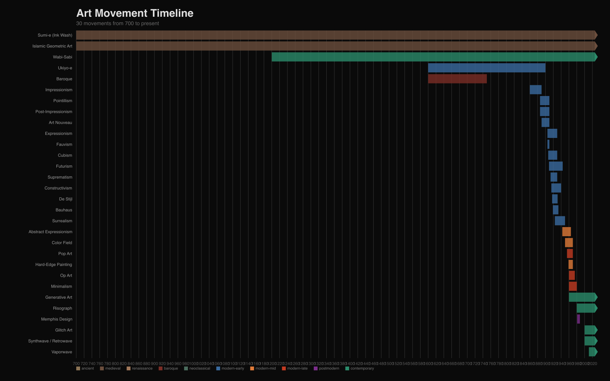
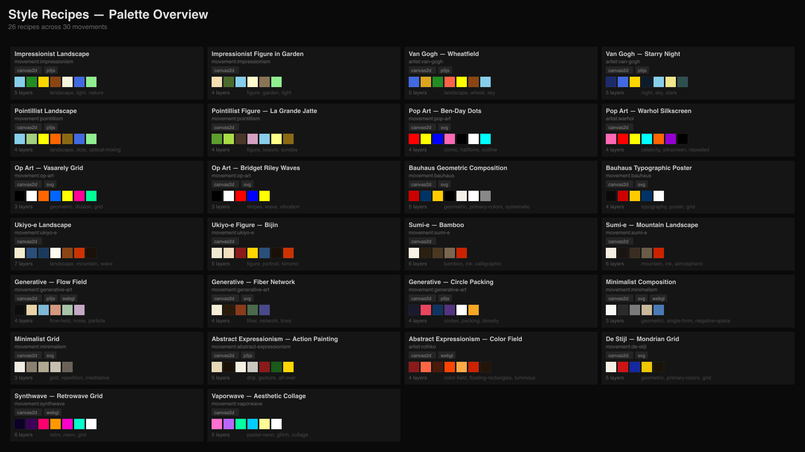
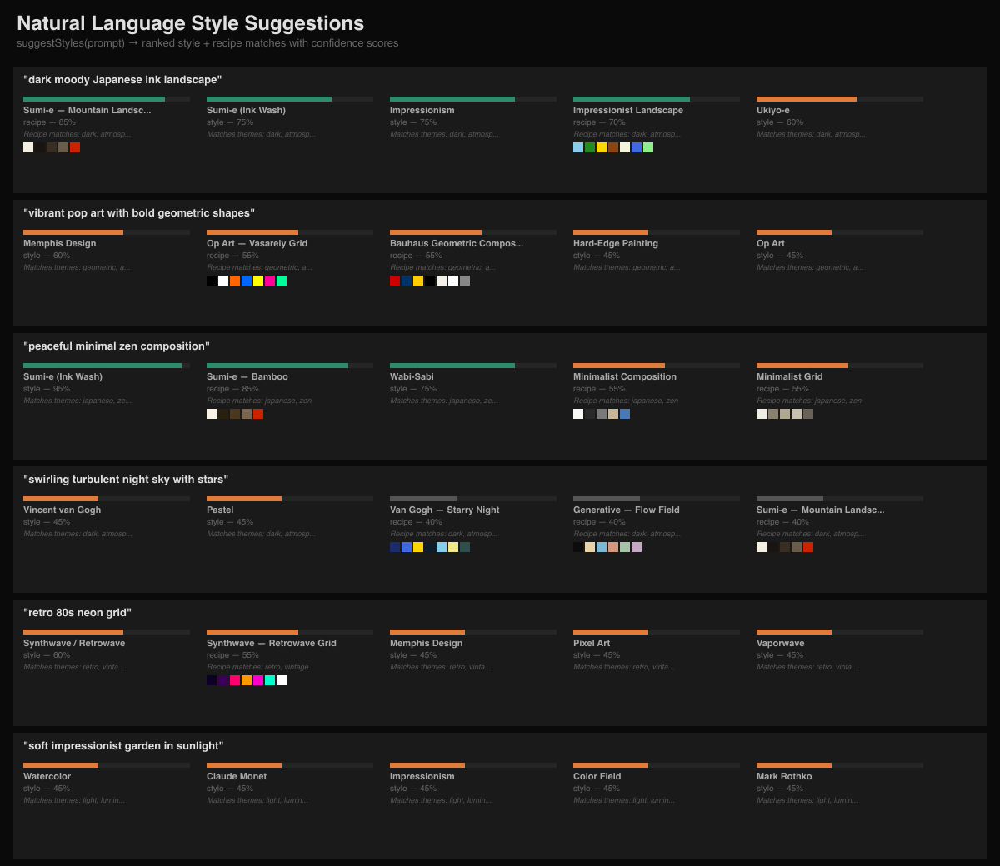
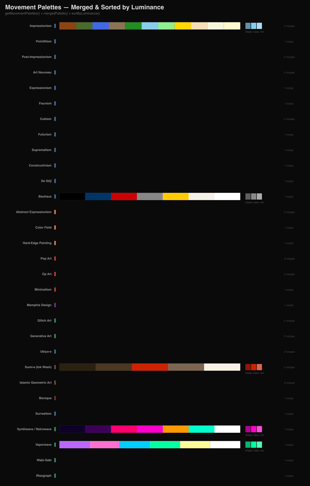
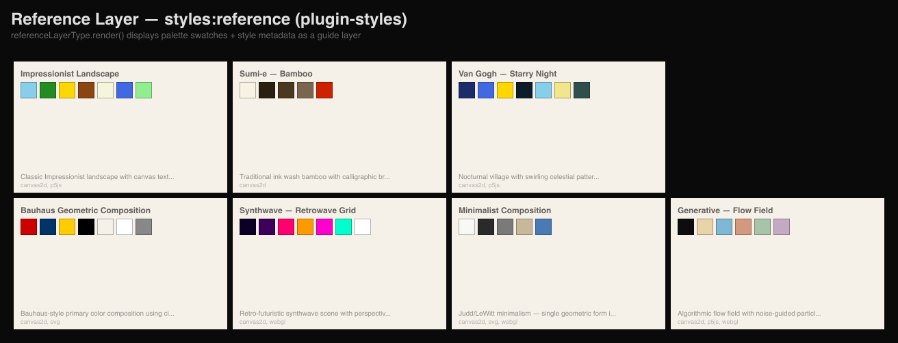
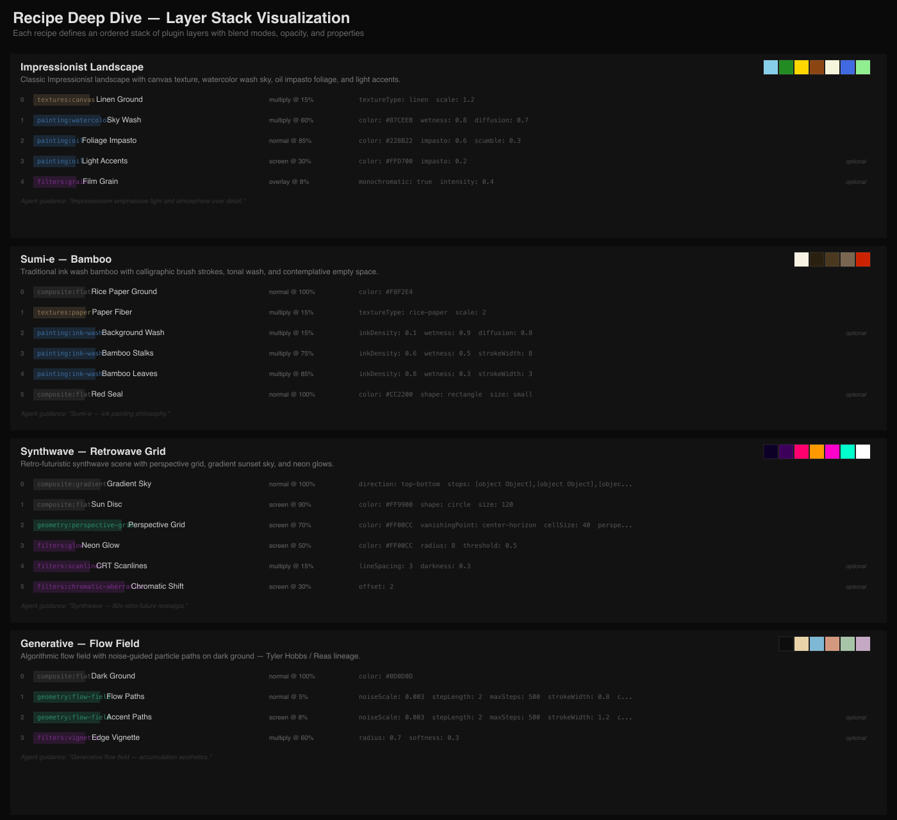
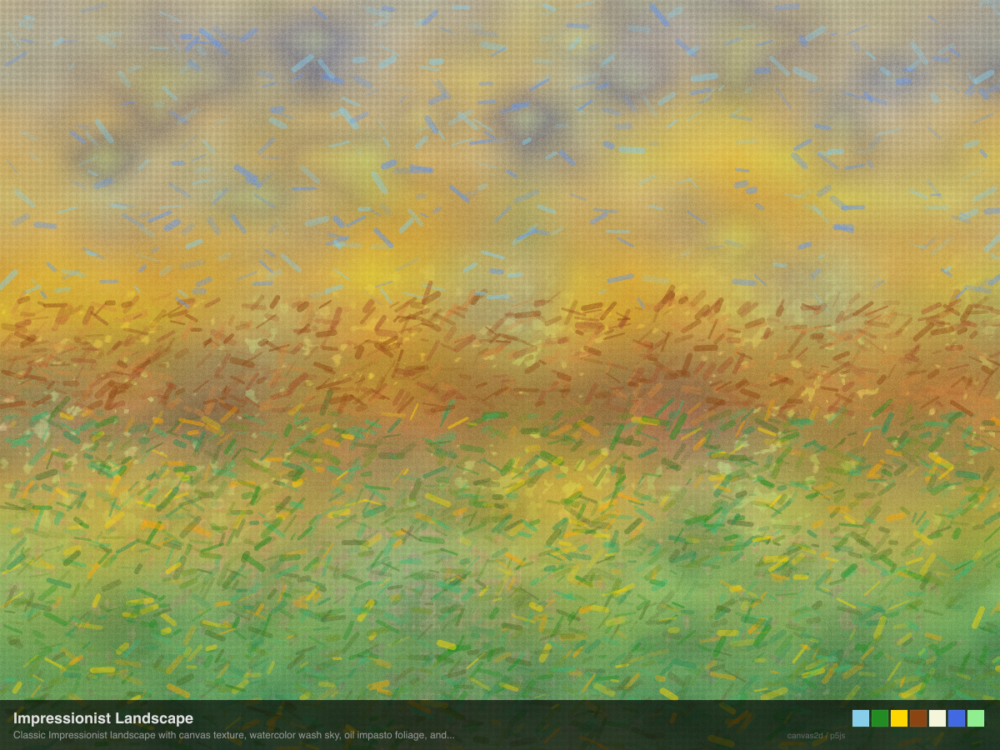
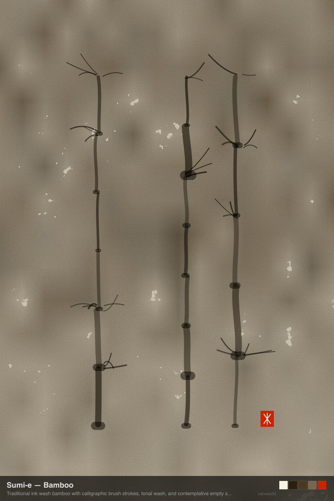
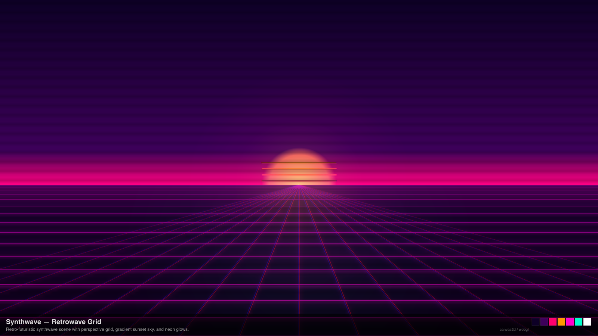
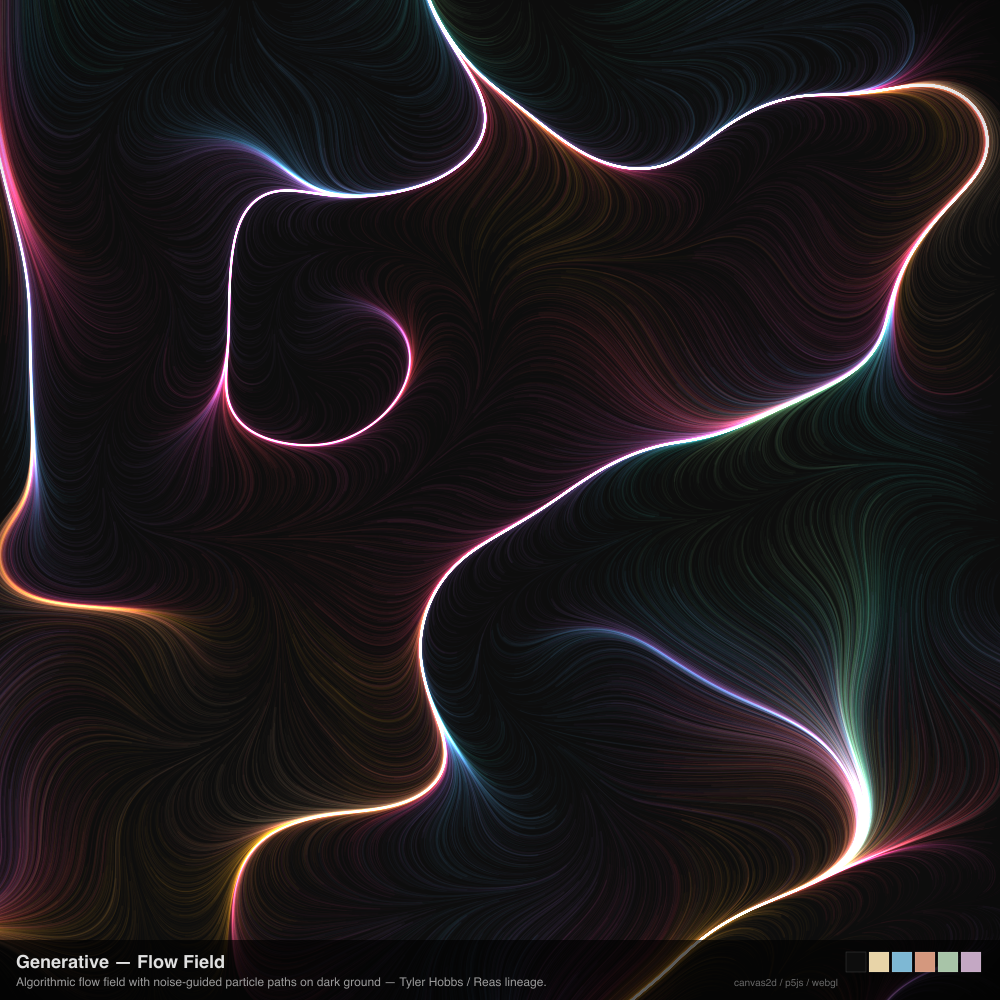

# Style Explorer

Visual showcase of `@genart-dev/styles` and `@genart-dev/plugin-styles` — style search, palette extraction, timeline, suggestions, and reference layer rendering.

## Setup

```bash
npm install
```

Requires local builds of `@genart-dev/styles`, `@genart-dev/plugin-styles`, `@genart-dev/plugin-painting`, and `@genart-dev/plugin-textures`.

## Scripts

```bash
npm run render          # Data visualizations (demos 1–6)
npm run render:recipes  # Recipe artwork renders (4 recipes)
npm run render:all      # Both
```

All output goes to `renders/`.

---

## Data Visualizations

### 1. Movement Timeline

Chronological bar chart of art movements colored by era, from ancient to contemporary.



### 2. Recipe Palette Grid

All recipes at a glance — name, style reference, renderer badges, palette swatches, layer count, and tags.



### 3. Style Suggestions

Natural-language prompts matched to styles and recipes via `suggestStyles()`, with confidence scores and reasons.



### 4. Movement Palettes

Merged palettes for each movement sorted by luminance, with tint/shade demos using the color utilities.



### 5. Reference Layer Demo

The `styles:reference` layer type from `plugin-styles` rendered for 8 recipes — displays palette swatches and style metadata as a guide layer.



### 6. Recipe Deep Dive

Detailed layer stack visualization for 4 selected recipes showing layer order, type IDs, blend modes, opacity, properties, and agent guidance.



---

## Recipe Artwork

Full recipe renders using real plugin layer types (`painting:watercolor`, `painting:oil`, `painting:ink`, `textures:canvas`, `textures:paper`) composited with canvas2d.

### Impressionist Landscape

Linen canvas texture, watercolor sky wash, oil impasto foliage, broken-color brushstroke dabs, light accents, water reflections, and film grain.



### Sumi-e Bamboo

Rice paper ground with fiber texture, dilute ink background wash, calligraphic bamboo stalks with joint nodes, decisive leaf strokes, and a vermillion artist seal.



### Synthwave Retrowave Grid

Gradient sky, sliced sun disc, perspective grid with multi-pass glow, horizon neon bloom, CRT scanlines, and chromatic aberration.



### Generative Flow Field

Noise-driven flow paths with spatially-mapped color from a second noise field, additive blending across three density passes, and a radial vignette.


