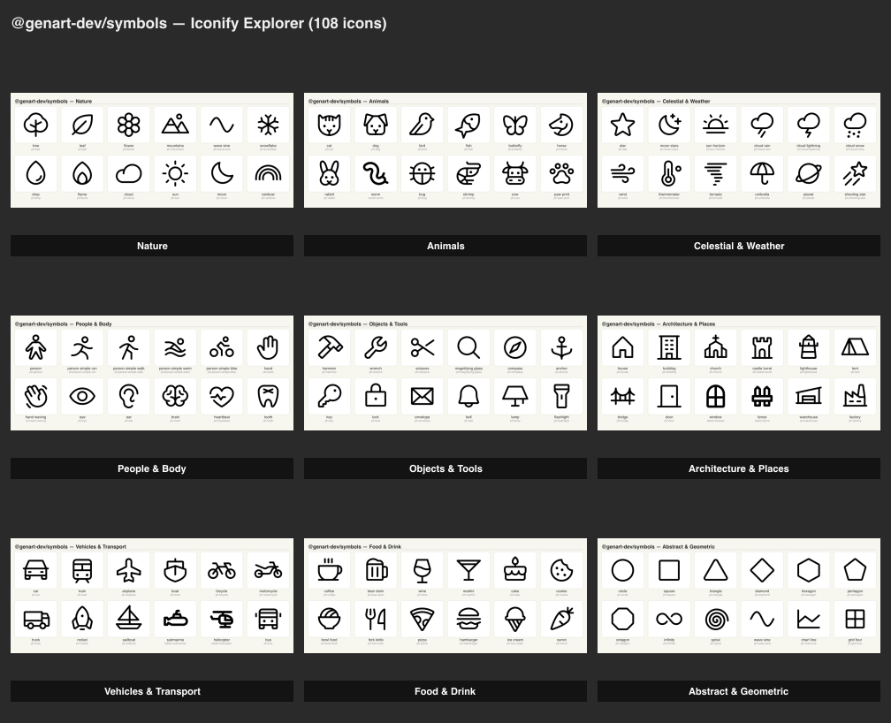

# Symbol Explorer

Batch-fetch and gallery-render 108 Iconify icons across 9 thematic groups via `@genart-dev/symbols`.



## Groups

| # | Group | Icons |
|---|-------|-------|
| 1 | Nature | tree, leaf, flower, mountains, wave-sine, snowflake, drop, flame, cloud, sun, moon, rainbow |
| 2 | Animals | cat, dog, bird, fish, butterfly, horse, rabbit, worm, bug, shrimp, cow, paw-print |
| 3 | Celestial & Weather | star, moon-stars, sun-horizon, cloud-rain, cloud-lightning, cloud-snow, wind, thermometer, tornado, umbrella, planet, shooting-star |
| 4 | People & Body | person, run, walk, swim, bike, hand, hand-waving, eye, ear, brain, heartbeat, tooth |
| 5 | Objects & Tools | hammer, wrench, scissors, magnifying-glass, compass, anchor, key, lock, envelope, bell, lamp, flashlight |
| 6 | Architecture & Places | house, building, church, castle-turret, lighthouse, tent, bridge, door, window, fence, warehouse, factory |
| 7 | Vehicles & Transport | car, train, airplane, boat, bicycle, motorcycle, truck, rocket, sailboat, submarine, helicopter, bus |
| 8 | Food & Drink | coffee, beer-stein, wine, martini, cake, cookie, bowl-food, fork-knife, pizza, hamburger, ice-cream, carrot |
| 9 | Abstract & Geometric | circle, square, triangle, diamond, hexagon, pentagon, octagon, infinity, spiral, wave-sine, chart-line, grid-four |

## Packages

- `@genart-dev/symbols` — `fetchAndParseIcon`

## Usage

```bash
npm install
node render.cjs
```

Output goes to `renders/` — one PNG per group plus a contact sheet.
