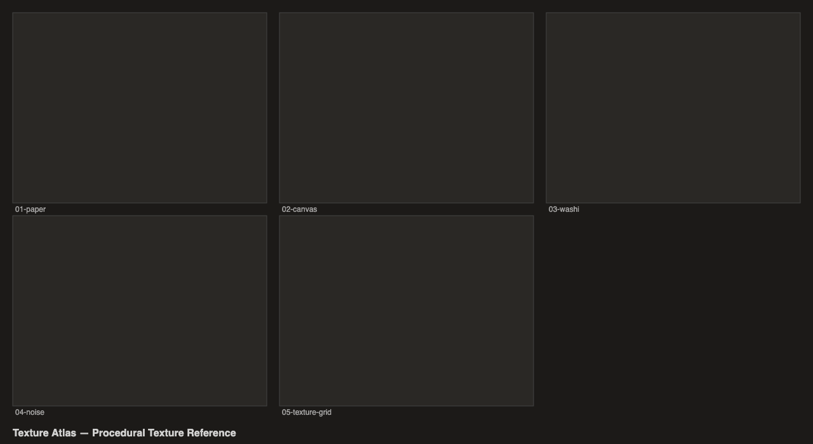

# Texture Atlas

Procedural texture reference card showcasing `@genart-dev/plugin-textures`.



## Scenes

| # | Scene | Source | Description |
|---|-------|--------|-------------|
| 1 | Paper Textures | [01-paper.genart](renders/01-paper.genart) | 8 paper variations — smooth, cold press, hot press, rough, tinted, kraft, dark |
| 2 | Canvas Textures | [02-canvas.genart](renders/02-canvas.genart) | 8 canvas weaves — fine to coarse, linen, warm, raw, dark |
| 3 | Washi Textures | [03-washi.genart](renders/03-washi.genart) | 8 washi papers — sparse to dense fibers, long/short, warm/cool/dark |
| 4 | Noise Textures | [04-noise.genart](renders/04-noise.genart) | 12 noise variations — value, fractal, ridged at different scales and color mappings |
| 5 | Texture Grid | [05-texture-grid.genart](renders/05-texture-grid.genart) | 4x4 reference card with one representative from each texture type |
| 6 | Contact Sheet | [texture-atlas.genart](renders/texture-atlas.genart) | Combined overview of all scenes |

## Plugins

- `@genart-dev/plugin-textures` — `textures:paper`, `textures:canvas`, `textures:washi`, `textures:noise`

## Usage

```bash
bash renders/render.sh
```

Output PNGs go to `renders/`.
