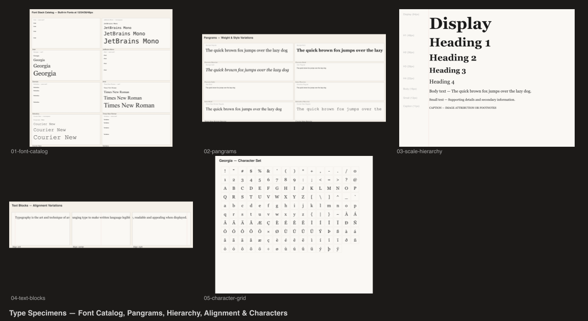

# Type Specimens

Typography specimen sheets showcasing `@genart-dev/plugin-typography`.



## Scenes

| # | Scene | Source | Description |
|---|-------|--------|-------------|
| 1 | Font Stack Catalog | [01-font-catalog.genart](renders/01-font-catalog.genart) | Each built-in font at multiple sizes |
| 2 | Pangrams | [02-pangrams.genart](renders/02-pangrams.genart) | Classic pangrams in different weights and styles |
| 3 | Scale & Hierarchy | [03-scale-hierarchy.genart](renders/03-scale-hierarchy.genart) | Typographic scale — display through caption |
| 4 | Text Blocks | [04-text-blocks.genart](renders/04-text-blocks.genart) | Paragraph layout with left/center/right alignment |
| 5 | Character Grid | [05-character-grid.genart](renders/05-character-grid.genart) | Full character set grid |
| 6 | Specimen Sheet | [specimen-sheet.genart](renders/specimen-sheet.genart) | Combined overview |

## Plugins

- `@genart-dev/plugin-typography` — `textLayerType`, `BUILT_IN_FONTS`, `resolveFontStack`

## Usage

```bash
bash renders/render.sh
```

Output PNGs go to `renders/`.
